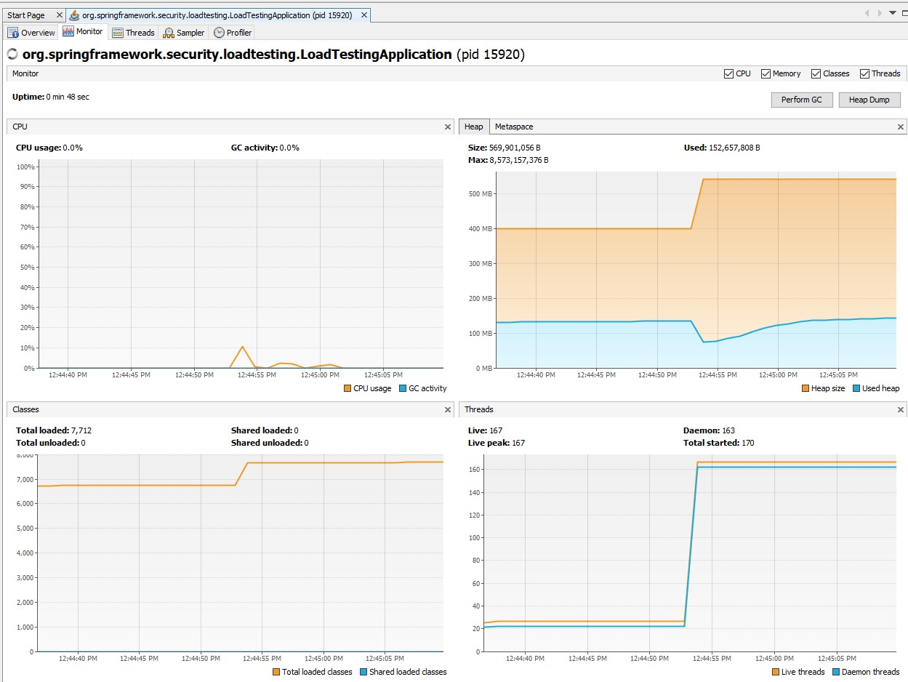
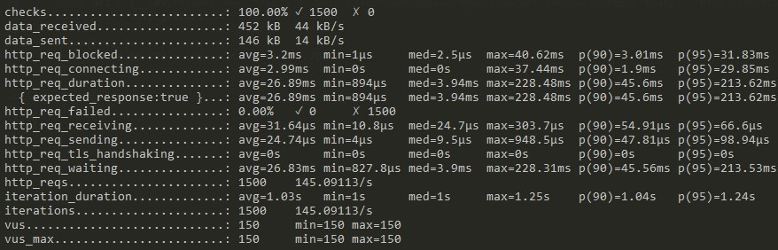
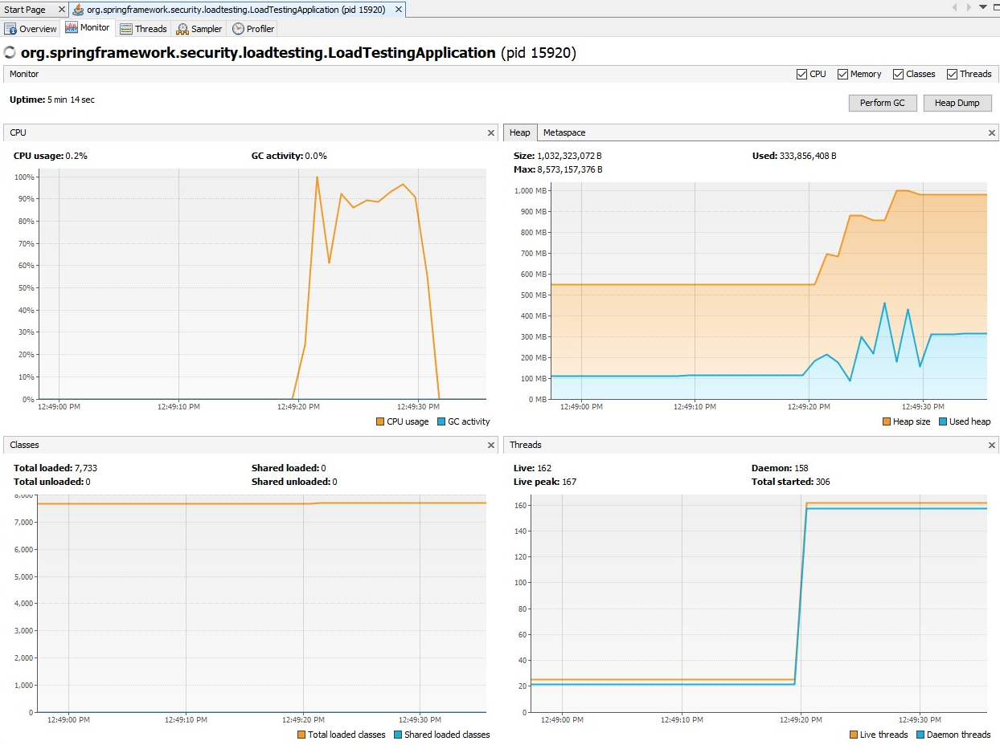
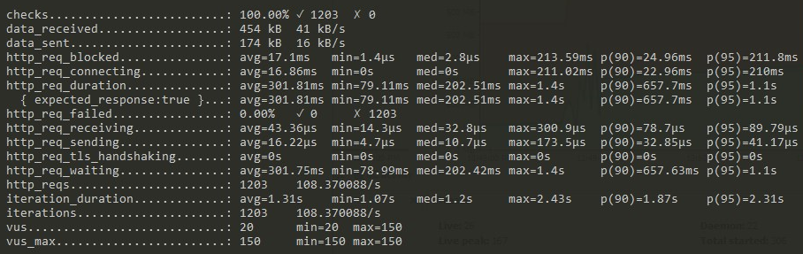

# spring-security-loadtesting
Project to demonstrate high CPU utilization for simple usage of spring security in a spring boot application.

# About the Application

The application under test is a fresh and simple Spring Boot Application (Spring Boot version 2.5.2) with 2 starters only (`spring-boot-starter-web` and `spring-boot-starter-security`) and default configuration (empty `application.properties`). It provides a controller with 2 endpoints that simply and immediately return a String as a result:

- `/public` - can be accessed without the need of authentication and returns "public"
- `/private` - must be accessed with BASIC authentication and returns "private"

# Steps to Reproduce

- Download source code
- Build project
- Run application
- Open application in JVisualVM
- Run load testing tool
  - Targeting "public" endpoint
  - Targeting "private" endpoint

## Download source code

```console
git clone https://github.com/rafaelvanderlei/spring-security-loadtesting.git
```

## Build project

```console
mvn clean package
```

## Run application

```console
java -jar target/loadtesting-0.0.1-SNAPSHOT.jar
```

## Open application in JVisualVM

Run the command (if needed, replace $JDK_HOME with the path to your JDK installation)

```console
./$JDK_HOME/bin/jvisualvm
```

Then select the `loadtesting-0.0.1-SNAPSHOT.jar` application

## Run load testing tool

There are two scenarios for the purpose of comparison: one targets a public endpoint and results in the expected CPU utilization and another targets a private endpoint (which requires basic authentication) and experiences a high CPU utilization while it's expected to have a more similar CPU utilization as the execution that targets the public endpoint.

For both scenarios, the load testing script will make 150 virtual users keep sending 150 requests/sec for the duration of 10 seconds.

In this project, I used K6 tool with Docker for its simplicity, but you can use any load testing tool (even a simple Java main method) and you'll be able to see same results for the application behavior in JVisualVM.

### Targeting "public" endpoint

From the root of the project, just run the following command:

```console
docker run --rm -i loadimpact/k6 run -e PRIVATE=false - <k6/script.js
```

The behavior of the application can be seen in JVisualVM, like in the following image:



K6 provided a summary of the execution, that can be seen in the following image:



We don't need to dive into all of the details, but we can see in the JVisualVM chart that CPU utilization remains mostly in under 10%. In the K6 summary, we can see that all 1500 requests were sent (150/s during 10s) and got responded with an avg time (`http_req_duration`) around 27ms.

### Targeting "private" endpoint

From the root of the project, just run the following command:

```console
docker run --rm -i loadimpact/k6 run -e PRIVATE=true - <k6/script.js
```

The behavior of the application can be seen in JVisualVM, like in the following image:



K6 provided a summary of the execution, that can be seen in the following image:



We don't need to dive into all of the details, but we can see in the JVisualVM chart that CPU utilization remains mostly in over 80% (even reaching a peak of 100%). In the K6 summary, we can see that only 1203 requests were sent (rather than the 1500 expected - 150/s during 10s) and got responded with an avg time (`http_req_duration`) around 302ms.

# Conclusion

The load testing executions presented here were able to show that when we tried to access an endpoint protected by BASIC authentication with Spring Security, the CPU utilization and the response time were extremely high when compared to when we tried to access an endpoint that doesn't require authentication.
